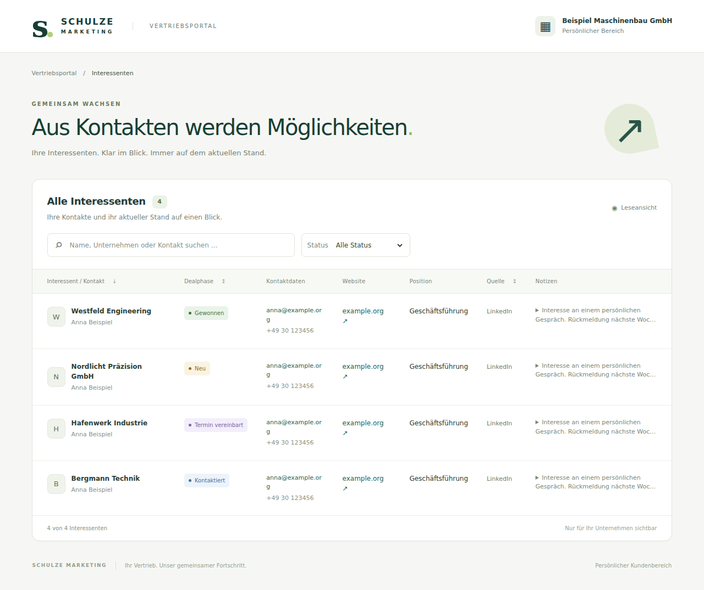

# Schulze Client Portal

One customer-facing React application for the LearningSuite Vertriebsportal. German/English lead overview with a DE/EN switch, responsive table/cards, search, status filter and sorting. Verified LearningSuite customer sessions can update existing leads by adding an interaction or changing the deal stage; there is no customer lead-creation path.

## Current delivery status

Frontend implemented and deployed at `https://schulze-client-portal-production.up.railway.app/`. The read API (`qpxbpg33KsqgeiP7`), scoped existing-lead update API (`MQZlQMHsB01tGN9w`), and private token issuer (`phBJ8osenbUnNCPb`) are published. FUL-V2-09 (`yhHEoqYAJGEJ1g0J`) now issues a customer-scoped portal grant only when creating a new Vertriebsportal Hub and injects the one-time bearer URL into `AirtableembedAppLinkNachEmbedd`. Only the SHA-256 token hash and non-secret grant metadata are persisted; V2-09, its issuer, and the V2-01 caller have execution payload persistence disabled.

The provisioning policy currently uses a 365-day portal-grant expiry. If Hub creation becomes uncertain after issuance, automatic re-issuance is blocked for manual reconciliation instead of silently creating another customer link. Existing LearningSuite Hubs are reused, but the documented LearningSuite API does not expose a creation-variable update endpoint; an existing Hub without the secure portal URL is therefore marked `Needs Migration` rather than mutated through an invented API contract.

The Airtable → Supabase snapshot workflow is active every five minutes, and the bearer-authorized bootstrap API now reads the private Supabase model. The dedicated n8n credential was verified with live writes and customer/admin reads. Restricted team access is issued manually with a 24-hour expiry. The frontend refreshes through non-sensitive Supabase invalidation events, with a 60-second polling fallback and refresh on focus. See `docs/portal-supabase-sync.md` for operator instructions and verification evidence.

No real customer onboarding or new production grant was issued during this cutover. The real LearningSuite customer iframe and populated two-customer isolation remain operator acceptance checks; automated browser tests use synthetic fixtures.

Live V2 metadata was verified on 2026-09-17. Portal isolation and scoped-read behavior were tested with synthetic fixtures; production customer data is not documented in this repository. See `docs/portal-supabase-sync.md` for the architecture and verification approach.

## Languages

Use **DE / EN** in the header. German is the default; the selection lasts for the current page session and does not store credentials or customer data. The interface, errors, filters and known German status labels are translated. Client names, contact details and notes remain as entered in Airtable. Switching languages preserves the bearer session and current filters.

## Local development

Requires Node 22.18+ (Node 24 also supported).

```sh
npm ci
cp .env.example .env
# Set VITE_API_BASE_URL to the HTTPS n8n API base.
npm run dev
```

Open the personal `/?token=...` link. An arbitrary token is never enough: n8n must validate it. For an intentional UI preview with synthetic data, run the Playwright tests; synthetic fixtures are only in tests, never in the application bundle.

```sh
npm run typecheck
npm test
npm run build
npx playwright install chromium
npm run test:browser
npm run test:production
```

Browser tests intercept HTTPS API calls using fabricated fixtures. They prove frontend behavior, not a working Airtable/n8n integration. An optional `PLAYWRIGHT_CHROMIUM_EXECUTABLE` environment variable supports a locally installed Chromium.

## API contract

### Existing-lead updates

Editing is exposed only for verified LearningSuite customer sessions. Legacy bearer-link sessions and Schulze admin sessions remain read-only.

`GET ${VITE_API_BASE_URL}/customer-portal/lead-options` returns the canonical Airtable single-select choices for the deal-stage field after verifying the LearningSuite bearer and customer scope.

`POST ${VITE_API_BASE_URL}/customer-portal/lead-update` accepts only an existing Airtable lead record ID plus an optional new interaction and/or deal-stage change. The backend re-verifies LearningSuite identity, resolves customer ownership server-side, validates the deal-stage choice against live Airtable schema, and uses the request ID to make interaction creation idempotent. It has no route for creating a new lead.

`GET ${VITE_API_BASE_URL}/customer-portal/bootstrap`

Authorization: `Bearer <43-character base64url opaque token>` (at least 256 bits of entropy). The native issuer generates 43 cryptographically random base64 characters and converts them to URL-safe form. Token shape validation in React is only input hygiene; all authorization runs in n8n. No customer ID/query selectors are accepted by the app. `credentials: omit`, no-store, redirect refusal, 25-second timeout, cancellation and sanitized errors are implemented.

```ts
type BootstrapResponse = {
  mode: "customer" | "admin";
  customer: { name: string };
  clients?: Array<{ id: string; clientId: string | null; name: string }>; // Admin only
  leads: Array<{
    id: string; // Portal-facing, no raw Airtable ID needed
    name: string;
    contactName: string | null;
    status: string | null;
    website: string | null;
    notes: string | null;
    email: string | null;
    phone: string | null;
    position: string | null;
    source: string | null;
    clientRecordId?: string; // Admin only
    clientName?: string; // Admin only
  }>;
};
```

Optional values must be `null`, not absent. Unknown fields are dropped, malformed/duplicate lead identifiers reject the whole response. Maximum 10,000 customer leads or 100,000 admin leads per response; the backend rejects oversized datasets rather than silently truncating.

Status codes: 401/403 invalid link; 429 rate limit; 5xx service error. No backend error detail is displayed. The API includes the configured portal CORS origin on success, unauthorized and service-error responses.

## Railway deployment

Production values expected for this deployment:

```env
VITE_API_BASE_URL=https://automation.schulzemarketing.de/webhook
API_ORIGIN=https://automation.schulzemarketing.de
FRAME_ANCESTORS=https://schulze.learningsuite.io
SUPABASE_ORIGIN=https://zwtmlrzwqnluosrdbjfv.supabase.co
PORT=8080
```

1. Save the variables on the `schulze-client-portal` Railway service, not only in Suggested Variables.
2. Redeploy after changing `VITE_API_BASE_URL`; Vite embeds it at build time.
3. Verify `https://schulze-client-portal-production.up.railway.app/healthz` returns 200.
4. Verify CSP allows `https://automation.schulzemarketing.de`, `https://zwtmlrzwqnluosrdbjfv.supabase.co`, and `wss://zwtmlrzwqnluosrdbjfv.supabase.co` in `connect-src` and `frame-ancestors https://schulze.learningsuite.io` (plus any other real iframe ancestors if LearningSuite nests frames).
5. Verify proxy/CDN access logs redact query strings and Authorization headers before using real bearer links. The included server itself logs only startup, never requests.
6. Verify the n8n OPTIONS preflight from the portal origin allows GET plus the `Authorization` header.

Docker build locally:

```sh
docker build --build-arg VITE_API_BASE_URL=https://automation.schulzemarketing.de/webhook -t schulze-portal .
docker run --rm -p 8080:8080 -e API_ORIGIN=https://automation.schulzemarketing.de -e FRAME_ANCESTORS=https://schulze.learningsuite.io schulze-portal
```

Other hosts can serve `dist/`, but must configure the same HTTP headers as `server.mjs`; CSP `frame-ancestors` cannot be set through HTML meta tags. Do not add `X-Frame-Options: SAMEORIGIN` or `DENY` to a working cross-origin LS deployment.

## LearningSuite

Keep the reusable template variable:

```html
<iframe
  src="[[AirtableembedAppLinkNachEmbedd]]"
  title="Ihre Interessenten"
  width="100%"
  height="1000"
  style="border:0"
  referrerpolicy="no-referrer"
></iframe>
```

For a newly created Vertriebsportal Hub, V2-09 supplies:

`https://schulze-client-portal-production.up.railway.app/?token=<one-time-issued-customer-token>`

The raw token exists only in the in-memory provisioning path long enough to create the Hub. The saved onboarding resource state contains `portalGrantId`, expiry and status, not the token. Existing Hubs that were created with the previous Airtable/appcode value require deliberate migration because the supplied LearningSuite API documentation has create/list/access endpoints but no documented endpoint for changing an existing Hub's creation variables.

## Security and limitations

- No Airtable PAT, n8n integration credential, or Supabase privileged key in the browser. The public Supabase key can read only non-sensitive invalidation events. Lead data always passes through the bearer-authorized API.
- Customer token is held in memory only. Query and fragment are removed on startup. Reloading the cleaned URL requires reopening the original LS link.
- Existing-lead write controls are enabled only when the portal was opened through a verified LearningSuite session. Legacy token links remain read-only.
- The initial token-bearing URL reaches the host/proxy before JavaScript executes. Infrastructure log redaction is mandatory; frontend URL cleanup does not solve server logs.
- Bearer links can be shared. They are not LearningSuite SSO. Expiration and immediate revocation are backend requirements.
- CSP permits configured API/realtime origins and LS ancestors. No analytics, third-party fonts, scripts or images.
- No local/session storage, cookies or service worker. No customer response cache.
- `backend/ownership.ts` is a tested server-side reference, not a deployed authorization service. It is never imported into React.

## File map

- `src/api/`: token consumption, API types, contract validation and sanitized errors.
- `src/App.tsx`: page shell and request lifecycle.
- `src/components/Leads.tsx`, `src/styles.css`: table/cards, filters and responsive styling.
- `server.mjs`, `Dockerfile`, `railway.json`, `.env.example`: deployment and headers.
- `tests/`: API, authorization reference, production security headers and browser tests.
- `backend/README.md`: verified mapping and integration notes.
- `backend/n8n/README.md`: live n8n IDs, security settings, provisioning and release checks.
- `docs/superpowers/`: approved design and implementation plan.

## Preview

Synthetic browser-test fixtures only:



[Mobile preview](docs/previews/mobile.png)


## LearningSuite sign-in

The shared portal iframe URL now supports LearningSuite authentication through `portal-session`. Client scope comes from the verified LS email matching Airtable Clients.Primary Contact; restricted admins are managed in Supabase `portal_admins`. No client selector or email from the browser grants access. Existing issued opaque links remain supported by the n8n bootstrap. See [installation, authorization and acceptance checks](docs/learning-suite-portal.md).
